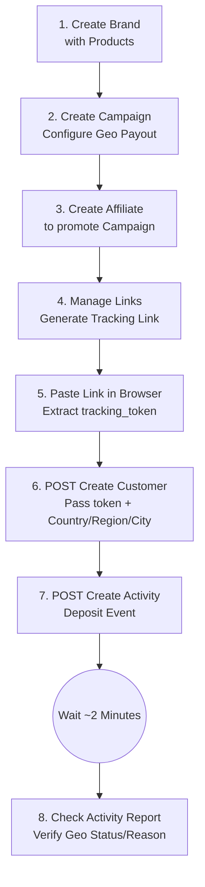
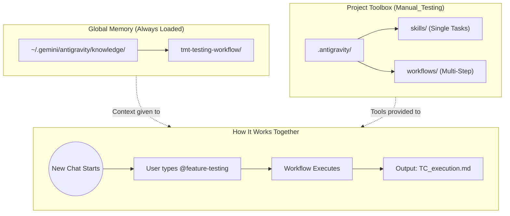

# 🧪 TMT Manual Testing Framework (AI-Assisted)

> An AI-powered manual testing framework for the **TMT Affiliate Marketing Platform** using [Antigravity](https://antigravity.dev) Skills, Workflows, and Knowledge Items.  
> Instead of writing test scripts, you describe what to test in plain English — the AI assistant executes curl-based E2E tests, generates TC sheets, and guides report verification.

---

## 📖 Table of Contents

- [What Is This?](#-what-is-this)
- [Quick Start (New Team Member)](#-quick-start-new-team-member)
- [Architecture Overview](#-architecture-overview)
- [Folder Structure](#-folder-structure)
- [Skills & Workflows Reference](#-skills--workflows-reference)
- [How to Use — Step by Step](#-how-to-use--step-by-step)
- [E2E Testing Flow](#-e2e-testing-flow)
- [Flow Diagrams](#-flow-diagrams)
- [Scenario Examples](#-scenario-examples)
- [What You Need to Provide](#-what-you-need-to-provide)
- [Domain Knowledge: Geo Targeting Logic](#-domain-knowledge-geo-targeting-logic)
- [Troubleshooting](#-troubleshooting)
- [Contributing](#-contributing)

---

## 🔍 What Is This?

This repository is a **testing framework** that uses an AI coding assistant (Antigravity / Gemini) to:

| Capability | How |
|-----------|-----|
| 📋 Generate Test Case sheets from PRDs | `@generate-tc-sheet` skill |
| 🧪 Run E2E payout tests via `curl` | `@e2e-api-testing` skill |
| 📊 Guide report verification | `@verify-reports` skill |
| 🔄 Execute full feature testing cycles | `@feature-testing` workflow |
| ⚡ Rapid scenario testing | `@quick-payout-test` workflow |
| 🐛 Bug fix verification + regression | `@regression-check` workflow |

### How it works (in 30 seconds)

1. You open this project in your IDE
2. Antigravity auto-loads the **Knowledge Items** (platform URLs, credentials, API config)
3. You invoke a **Skill** or **Workflow** in the chat (e.g., `@feature-testing`)
4. The AI parses your PRD, generates a TC sheet, runs curl commands, and updates results
5. You get a ready-to-share TC execution report

---

## 🚀 Quick Start (New Team Member)

### Prerequisites

- macOS / Linux
- An IDE with **Antigravity** or **Gemini** extension installed (VS Code, Cursor, etc.)
- Git

### Setup (one-time)

```bash
# 1. Clone the repository
git clone <repo-url>
cd Manual_Testing

# 2. Run the setup script (installs Knowledge Items into Antigravity's global memory)
chmod +x setup.sh
./setup.sh

# 3. Open the project in your IDE
code .   # or: cursor .
```

### Verify it works

1. Open the Antigravity / Gemini chat panel in your IDE
2. Start a new conversation
3. Type: `@tmt-testing Tell me about the TMT platform`
4. ✅ If the AI knows about TMT, platform URLs, and Postman config — setup is complete!

---

## 🏗️ Architecture Overview

This framework has **two layers** that work together:

```
┌─────────────────────────────────────────────────────────┐
│                    GLOBAL MEMORY                         │
│    ~/.gemini/antigravity/knowledge/                      │
│    └── tmt-testing-workflow/                             │
│        ├── metadata.json                                 │
│        └── artifacts/                                    │
│            ├── tmt_testing_workflow.md  (Full test flow)  │
│            └── postman_config.md       (API config)       │
│                                                          │
│    → Auto-loaded at the START of every conversation      │
│    → Contains: URLs, credentials, API keys, endpoints    │
│    → Installed by setup.sh                               │
└─────────────────────────────────────────────────────────┘
        │
        │  Context is given to ↓
        ▼
┌─────────────────────────────────────────────────────────┐
│                 PROJECT TOOLBOX                           │
│    Manual_Testing/                                       │
│    └── .antigravity/                                     │
│        ├── skills/      (Single-task instructions)       │
│        └── workflows/   (Multi-step sequences)           │
│                                                          │
│    → Loaded when you @mention them in chat               │
│    → Skills = atomic tasks (generate TC, run curl, etc.) │
│    → Workflows = chain multiple skills together          │
└─────────────────────────────────────────────────────────┘
```

> **Why two layers?**  
> Knowledge Items store **secrets and platform config** globally (not in the repo).  
> Skills & Workflows store **reusable instructions** in the repo (shareable with team).  
> The `setup.sh` script bridges the two by copying KI files from the repo into the global location.

---

## 📁 Folder Structure

```
Manual_Testing/
├── .antigravity/                          ← AI assistant config (committed to repo)
│   ├── skills/                            ← Single-task instructions
│   │   ├── tmt-testing.md                 ← Platform & domain knowledge
│   │   ├── generate-tc-sheet.md           ← Creates TC sheet from PRD
│   │   ├── e2e-api-testing.md             ← Runs curl-based E2E payout tests
│   │   └── verify-reports.md              ← Guides report verification
│   └── workflows/                         ← Multi-step sequences
│       ├── feature-testing.md             ← Full PRD → tested TC sheet
│       ├── quick-payout-test.md           ← Rapid scenario testing
│       └── regression-check.md            ← Bug fix verification
│
├── knowledge/                             ← Knowledge Items (copied to global by setup.sh)
│   └── tmt-testing-workflow/
│       ├── metadata.json                  ← KI metadata, tags, references
│       └── artifacts/
│           ├── tmt_testing_workflow.md     ← Full test execution flow
│           └── postman_config.md           ← Postman headers, endpoints, bodies
│
├── docs/                                  ← Flow diagrams (open in browser)
│   ├── Testing_Flow_Diagram.html          ← E2E testing execution flow
│   └── Folder_Structure_Flow_Diagram.html ← Architecture & working flow
│
├── city_region_payout_TCs.csv             ← Test case data (CSV)
├── city_region_payout_TC_execution.md     ← Test execution report (example)
│
├── setup.sh                               ← One-time setup script
├── .gitignore
└── README.md                              ← This file
```

> 📌 **For each new feature**, a new `<feature_name>_TC_execution.md` file is generated here.

---

## ⚡ Skills & Workflows Reference

### Skills (Single Tasks)

| # | Skill | Invoke With | What It Does |
|---|-------|-------------|--------------|
| 1 | **TMT Testing** | `@tmt-testing` | Full platform & domain knowledge — use for any testing question |
| 2 | **Generate TC Sheet** | `@generate-tc-sheet` | Parses a PRD and creates a complete TC execution sheet |
| 3 | **E2E API Testing** | `@e2e-api-testing` | Runs curl commands to create customers/activities with geo data |
| 4 | **Verify Reports** | `@verify-reports` | Step-by-step guide to verify data in Activity/Campaign/Affiliate reports |

### Workflows (Multi-Step Sequences)

| # | Workflow | Invoke With | What It Does |
|---|----------|-------------|--------------|
| 1 | **Feature Testing** | `@feature-testing` | Complete cycle: PRD → TC sheet → UI test → API test → Reports → Summary |
| 2 | **Quick Payout Test** | `@quick-payout-test` | Rapid scenario testing — curl calls + report check, no TC sheet |
| 3 | **Regression Check** | `@regression-check` | Verify bug fix + run related TCs + smoke test for regressions |

### When to Use Which

| Situation | Use |
|-----------|-----|
| Got a new PRD, need full testing | `@feature-testing` (workflow) |
| Just need a TC sheet, no execution yet | `@generate-tc-sheet` (skill) |
| Quick test 2–3 payout scenarios | `@quick-payout-test` (workflow) |
| Bug fix, need retest + regression | `@regression-check` (workflow) |
| Need to check reports after testing | `@verify-reports` (skill) |

---

## 📋 How to Use — Step by Step

### 1. Open the project in your IDE

```bash
cd Manual_Testing
code .   # or: cursor .
```

### 2. Open the Antigravity / Gemini chat panel

### 3. Invoke a Skill or Workflow

Simply type `@` followed by the skill/workflow name in the chat:

```
@feature-testing

Feature: City & Region Level Payout Coverage
PRD: <paste your PRD here>
API Doc: <paste API doc here>
Tracking Token: 69e681d0b6e25fc69a199a49
Campaign ID: 56
Panel: TMT
```

### 4. Follow the AI's instructions

The AI will:
- Generate a TC sheet
- Run curl commands for E2E testing
- Tell you when to check reports
- Update the TC sheet with Pass/Fail results

---

## 🔄 E2E Testing Flow

```
📄 PRD + API Doc (you provide)
    ↓
📋 TC Sheet created (@generate-tc-sheet)
    ↓
🖥️  UI Testing (you do in browser, share findings)
    ↓
🔗 Generate Tracking Link (Campaign → Manage Links → Generate)
    ↓
🌐 Paste link in browser → copy tracking_token from URL
    ↓
📡 E2E Testing (@e2e-api-testing)
   → curl: Create Customer (with country/region/city)
   → curl: Create Activity
   → Wait ~2 min
    ↓
📊 Report Verification (@verify-reports)
   → Activity Report, Campaign Report, Affiliate Report
   → Check filters, columns, export
    ↓
✅ TC Sheet updated with Pass/Fail + Bugs
```

---

## 📊 Flow Diagrams

Two interactive flow diagrams are included in the `docs/` folder. Open them in any browser:

### Testing Execution Flow
```bash
open docs/Testing_Flow_Diagram.html
```
Shows the complete E2E testing process:



### Folder Structure & Working Flow
```bash
open docs/Folder_Structure_Flow_Diagram.html
```
Shows how Knowledge Items (global) interact with Skills & Workflows (project-specific):



---

## 🟢 Scenario Examples

### Scenario 1: "I got a new PRD, create TC sheet"
```
@generate-tc-sheet

Feature: Product-Wise Payout

PRD:
<paste full PRD here>

API Design Doc:
<paste API doc here, if available>
```
**Result**: TC sheet created at `Manual_Testing/<feature>_TC_execution.md`

---

### Scenario 2: "Test this feature end-to-end"
```
@feature-testing

Feature: City & Region Level Payout Coverage
Campaign ID: 56
Tracking Token: 69e681d0b6e25fc69a199a49

PRD:
<paste PRD>
```
**Result**: Full test cycle — TC sheet → curl tests → report verification → summary

---

### Scenario 3: "Quick test a few payout scenarios"
```
@quick-payout-test

Campaign: 56
Tracking Token: 69e681d0b6e25fc69a199a49
Panel: TMT
Scenarios:
1. Country=US, Region=California, City=LA → should pass
2. Country=US, Region=Texas, City=Houston → should reject
3. Country=IN → should reject (wrong country)
```
**Result**: Quick summary table with Pass/Fail per scenario

---

### Scenario 4: "Bug fix, need to retest"
```
@regression-check

Bug: GEO-005 — Region exclusion not working for Texas
Original TC: GEO-005
Fix Description: Fixed region_mode evaluation order
Campaign: 56
Tracking Token: 69e681d0b6e25fc69a199a49
```
**Result**: Bug verified + regression smoke test + updated TC sheet

---

### Scenario 5: "Check reports after testing"
```
@verify-reports

I just created test activities. Check:
- Activity Report for geo rejection
- Campaign Report for region/city columns
- Export for correct columns
```
**Result**: Step-by-step report verification guide

---

## 📝 What You Need to Provide

| What | When | Example |
|------|------|---------|
| PRD text | New feature | Paste full PRD |
| API Design Doc | New feature | Paste API doc |
| Tracking Token | E2E testing | `69e681d0b6e25fc69a199a49` |
| Campaign ID | E2E testing | `56` |
| Panel name | E2E testing | `AB Network` / `TMT` |
| x-api-key | Only if different panel | Paste from Configuration → Automation → API Keys |

> **Note**: Login credentials and TMT x-api-key are already saved in the Knowledge Item. You don't need to provide them every time.

---

## 🌍 Domain Knowledge: Geo Targeting Logic

```
Hierarchy:  Country → Region (State/Province) → City

Rules:
- Country = ALL → Region & City disabled, Include/Exclude hidden
- Country selected → Region selector appears
- Region selected → City selector appears

Include/Exclude Logic:
- Exclusion ALWAYS overrides Inclusion
- More specific level overrides broader level
- Priority: City > Region > Country

Evaluation Order:
1. Check Country eligibility
2. Check Region (include/exclude)
3. Check City (include/exclude)
→ If excluded: Rejected (Geo Not Allowed)
→ If included: Process normally
→ If not specified: Default to Country logic

Key Examples:
- USA, Include CA, Exclude LA → LA rejected, SF passes
- USA, Exclude TX, Include Houston → Houston rejected (region exclusion wins)

Schema fields: region, region_mode ('include'|'exclude'), city, city_mode
Default mode: 'include' (backward compatibility)
```

---

## ❓ Troubleshooting

| Problem | Solution |
|---------|----------|
| AI doesn't know about TMT platform | Run `./setup.sh` again — KI may not be installed |
| Skills don't appear when typing `@` | Make sure Antigravity extension is installed and project is open as workspace |
| `curl` commands fail with 401 | x-api-key is panel-specific — get the correct one from Configuration → Automation → API Keys |
| Reports don't show data | Wait ~2 minutes after creating activity — there's a processing delay |
| TC sheet not created | Check that `Manual_Testing/` folder is writable |

---

## 🤝 Contributing

### Adding a new Skill
1. Create a new `.md` file in `.antigravity/skills/`
2. Follow the structure of existing skills (Purpose → Prerequisites → Instructions → Examples)
3. Invoke with `@<filename-without-extension>`

### Adding a new Workflow
1. Create a new `.md` file in `.antigravity/workflows/`
2. Define Steps that chain existing Skills
3. Invoke with `@<filename-without-extension>`

### Adding Knowledge Items
1. Add new knowledge to `knowledge/<topic-name>/artifacts/`
2. Update `metadata.json` with the new artifact reference
3. Run `./setup.sh` again (or tell team members to re-run)

### Adding TC Execution Sheets
After testing a new feature, commit the generated `<feature>_TC_execution.md` file for historical reference.

---

## 📜 License

Internal use only — TMT QA Team.
